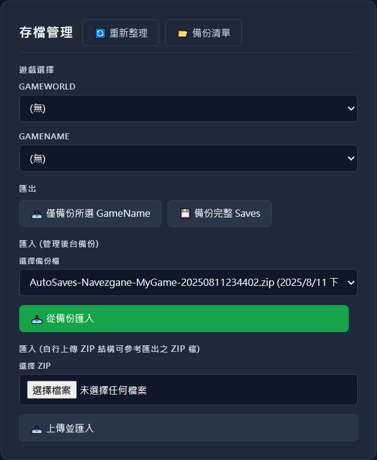

# 7 Days to Die Dedicated Server Plus

### 📦 [Open Source Repository](https://github.com/waynechen251/7-days-to-die-dedicated-server-plus.git) ｜ [GitHub Release](https://github.com/waynechen251/7-days-to-die-dedicated-server-plus/releases) ｜ [Bahamut Forum](https://forum.gamer.com.tw/Co.php?bsn=24608&sn=6631)

### 🌐 Documentation: [繁體中文](https://github.com/waynechen251/7-days-to-die-dedicated-server-plus/blob/main/readme.md) ｜ [English](https://github.com/waynechen251/7-days-to-die-dedicated-server-plus/blob/main/readme.en.md)

### 🌐 Installation Guide: [繁體中文](https://github.com/waynechen251/7-days-to-die-dedicated-server-plus/blob/main/docs/install.md) ｜ [English](https://github.com/waynechen251/7-days-to-die-dedicated-server-plus/blob/main/docs/install.en.md)

# Installation Guide

**Quick Navigation:** [System Requirements](#system-requirements) ｜ [Installation Steps](#getting-and-using-the-program) ｜ [File Structure](#file-structure-what-you-should-see-after-installation) ｜ [First Launch](#first-launch) ｜ [Troubleshooting](#troubleshooting) ｜ [Uninstall](#uninstall)

---

## Intended Audience

- Regular players
- Server owners

---

## System Requirements

| Item             | Requirement                                      |
| ---------------- | ------------------------------------------------ |
| Operating System | Windows 10/11 (64-bit), Windows Server 2019/2022 |
| Disk Space       | At least 20 GB (including game server and backups) |
| Memory           | At least 16 GB RAM                               |
| Network          | Your budget determines your network performance  |

---

## Getting and Using the Program

### Using the Inno Setup Installer

1. Go to the GitHub Releases page and download the latest installer: **[7DTD-DS-P-Setup](https://github.com/waynechen251/7-days-to-die-dedicated-server-plus/releases)**
   

2. Launch the installer
   
   Select the installation language and click OK.

3. Agree to the license agreement
   
   Select I Agree and proceed.

4. Choose the installation path
    
    It's recommended to install on a non-system drive (not C:\) and avoid spaces, non-English characters, and non-numeric characters in the path.
   Example: `D:\7DTD-DS-P\`

5. Select the port for the Web Management Interface
   
   Default: `26901`

   > Tip 1: To allow LAN access to the management panel, open port `26901` in the host machine's firewall.
   > Tip 2: To allow public access, configure port forwarding on your router to forward `26901` to the host machine's IP.
   > Tip 3: !!!!! There is currently no access control. Do not expose the management panel to the public Internet unless you know what you are doing !!!!!

6. This step doesn't need much explanation
   
   Just click Next.

7. Confirm installation details
   
   Avoid installing on the C: drive if possible. Click Install if everything looks good.

8. Wait for the installation to complete
   

- During installation, the following will be set up:
  - Web Management panel
  - Microsoft Visual C++ Redistributable
  - Amazon Root CA 1.crt root certificate (Epic Online Services)

9. Finish installation
    
    Clicking Finish will automatically open the management panel in your browser.
   If nothing happens, manually open your browser and go to `http://localhost:26901`.

10. If the site doesn't open, check whether the Windows service has been correctly registered and started.
    

---

## File Structure (What You Should See After Installation)

| Directory/File     | Description                                           |
| ------------------ | ----------------------------------------------------- |
| `7daystodieserver` | Game server directory, created when installing the game |
| `dependencies`     | Third-party dependencies                              |
| `logs`             | Log files                                             |
| `public`           | Web management panel and save backup directory        |
| `scripts`          | Installation scripts                                  |
| `steamcmd`         | SteamCMD directory, requires steamcmd.exe             |
| Other files        | Configuration and executable files                    |

> When installing/updating the game server, files will be placed in `./7DaysToDieServer/`.

---

## First Launch

1. **Open the Management Panel**

   

2. **Download or Update the Game Server (Required)**

   **SteamCMD**

   - In the **SteamCMD** section on the page, select the version and click "Install / Update".
     
   - When you see "✅ Install / Update complete, Exit Code: 0", it means the process is finished.
     

3. **Check and Configure serverconfig.xml**

   - Click "🛠 Start Server / View serverconfig.xml" on the page.
     
   - Required values
     - `ServerPort`: Default 26900 (7 Days to Die server player connection port)
     - `TelnetEnabled`: True (Enable Telnet for management panel access)
     - `TelnetPort`: Default 8081 (Telnet remote management port)
     - `TelnetPassword`: Set a non-empty password (Telnet remote management password)
   - Suggested values:
     - `EACEnabled`: False (Mods cannot be used when EAC is enabled)
     - `UserDataFolder`: D:\7DTD-DS-P\Data (server save directory; a Saves folder will be created automatically)
   - After completing the configuration, click "Save and Start".
     

4. **Save Management (optional)**
   

   - Export server saves or import an existing save (Zip).
   - You may also skip this and start a new save, then export later.

5. **Start the Server**
   - The Console below will display logs in real-time; wait until the game server has fully started before using it.
     

---

## Firewall and Connection

- To allow external players to join your server, please open the following in Windows Firewall/router:
  - `ServerPort` (Game connection)
- The specific port values should be based on your `serverconfig.xml`.

---

## Uninstall

### Method 1: Using Windows Settings

1. Open "Settings" → "Apps" → "Installed apps"
2. Search for "7DTD-DS-P"
3. Click Uninstall

### Method 2: Using Control Panel

1. Open "Control Panel" → "Programs and Features"
2. Find "7 Days to Die Dedicated Server Plus"
3. Click Uninstall

### Manual Cleanup (Optional)

After uninstalling, the following folders may need to be manually deleted:
- Installation directory (e.g., `D:\7DTD-DS-P`)
- Game saves (`UserDataFolder` path)

---

## Troubleshooting

### Management Panel Won't Open

1. Confirm the Windows service `7DTD-DS-P` is running
   - Press `Win + R`, type `services.msc`, find the service and verify status is "Running"
2. Check if the firewall is blocking port 26901
3. Try accessing `http://127.0.0.1:26901`
4. If the service isn't running, try restarting it as Administrator

### Management Panel is Masked, Buttons Unresponsive?

When first opened or if the backend is not connected, the page will be **locked** to prevent accidental operations; it will unlock once the status in the management panel turns green.

### SteamCMD Installation/Update Failed

1. Check your network connection
2. Confirm sufficient disk space (at least 15GB free)
3. Re-run the installer as Administrator
4. If the problem persists, try deleting the `steamcmd` folder and reinstalling

### Installation/Update Seems Slow?

SteamCMD itself may output logs slowly; if the SteamCMD status in the management panel is green, it means it is still running, please be patient and wait for the completion message.

### Game Server Won't Start

1. Verify `serverconfig.xml` is configured correctly
   - Check that `ServerPort` and `TelnetPort` don't conflict with other programs
2. Ensure `TelnetPassword` is set (cannot be empty)
3. Check the Console logs for error messages
4. Confirm the game server is properly installed (check the `7daystodieserver` folder)

### Telnet Connection Failed

1. Confirm `TelnetEnabled` is set to `True`
2. Verify `TelnetPort` and `TelnetPassword` are configured correctly
3. Wait for the server to fully start (check Console logs to confirm startup is complete)
4. Check if another program is using the Telnet port

### Players Cannot Connect to the Server

1. Confirm Windows Firewall has opened `ServerPort` (default 26900)
2. If using a router, ensure port forwarding is configured
3. Confirm the server has fully started
4. Players should use the correct IP and Port when connecting

---

## Advanced Settings

### Common serverconfig.xml Parameters

| Parameter              | Default | Description                    |
| ---------------------- | ------- | ------------------------------ |
| `ServerName`           | -       | Server name                    |
| `ServerPort`           | 26900   | Game connection port           |
| `ServerMaxPlayerCount` | 8       | Maximum number of players      |
| `GameWorld`            | -       | Map name                       |
| `GameName`             | -       | Save name                      |
| `TelnetEnabled`        | False   | Whether to enable Telnet       |
| `TelnetPort`           | 8081    | Telnet port                    |
| `TelnetPassword`       | -       | Telnet password (required)     |
| `EACEnabled`           | True    | Whether to enable Easy Anti-Cheat |
| `UserDataFolder`       | -       | Custom save path               |

### Custom Installation Path

You can customize the installation path during setup. Recommendations:
- Use a non-system drive (avoid C:\)
- Path should not contain spaces or special characters
- Examples: `D:\7DTD-DS-P\` or `E:\GameServers\7DTD\`

---

## FAQ

If you have other questions, please report them at [GitHub Issues](https://github.com/waynechen251/7-days-to-die-dedicated-server-plus/issues).
