🌐 [繁體中文](install.md) | [English](install.en.md)

# Installation Guide

## Intended Audience

- Regular players
- Server owners

---

## 1. System Requirements

- **Operating System**: Windows 10/11(64-bit), Windows Server 2019/2022
- **Disk Space**: At least 20 GB (including game server and backups)
- **Network**: Your budget determines your network performance

---

## 2. Getting and Using the Program

### Using the Inno Setup Installer

1. Go to the GitHub Releases page and download the latest installer: **[7DTD-DS-P-Setup](https://github.com/waynechen251/7-days-to-die-dedicated-server-plus/releases)**  
   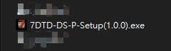

2. Launch the installer  
   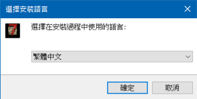  
   Select the installation language and click OK.

3. Agree to the license agreement  
   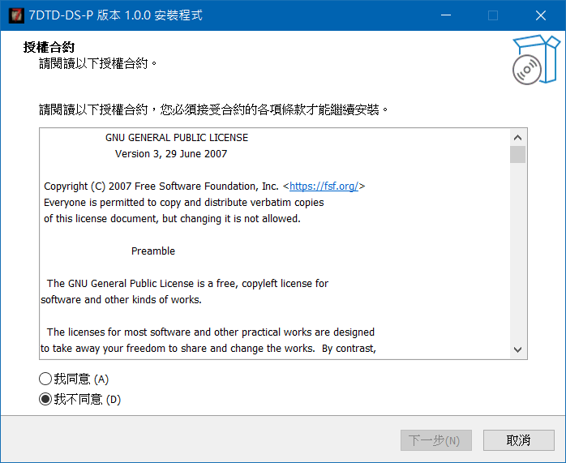  
   Select I Agree and proceed.

4. Choose the installation path  
    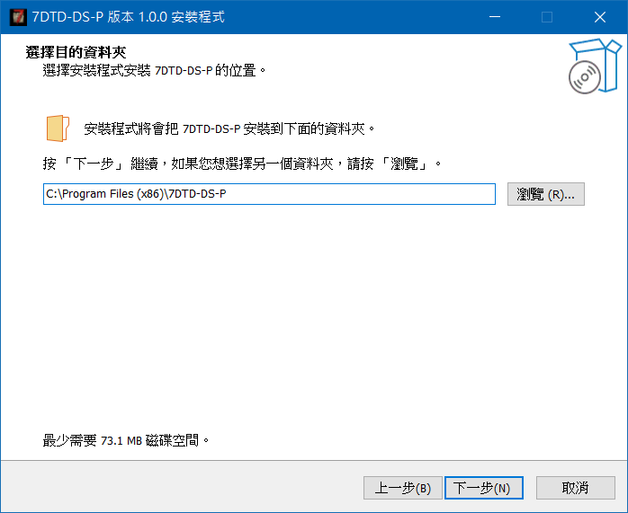  
    It’s recommended to install on a non-system drive (not C:\) and avoid spaces, non-English characters, and non-numeric characters in the path.
   Example: `D:\7DTD-DS-P\`

5. Select the port for the Web Management Interface  
   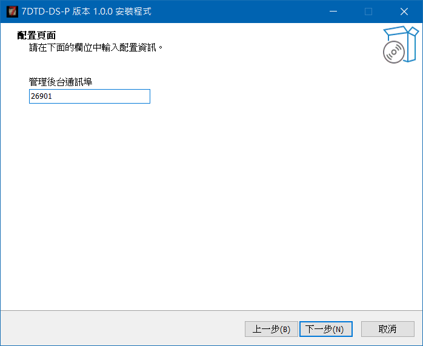  
   Default: `26901`

   > Tip 1: To allow LAN access to the management panel, open port `26901` in the host machine’s firewall.  
   > Tip 2: To allow public access, configure port forwarding on your router to forward `26901` to the host machine’s IP.  
   > Tip 3: !!!!! There is currently no access control. Do not expose the management panel to the public Internet unless you know what you are doing !!!!!

6. This step doesn’t need much explanation  
   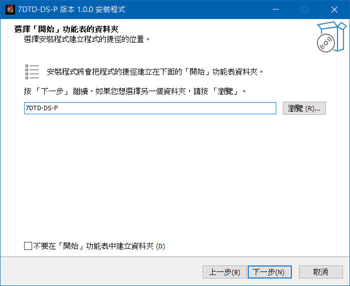  
   Just click Next.

7. Confirm installation details  
   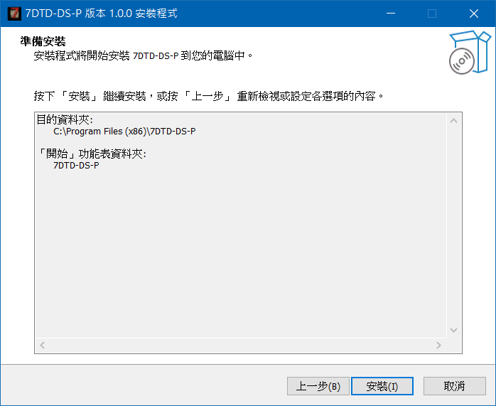  
   Avoid installing on the C: drive if possible. Click Install if everything looks good.

8. Wait for the installation to complete  
   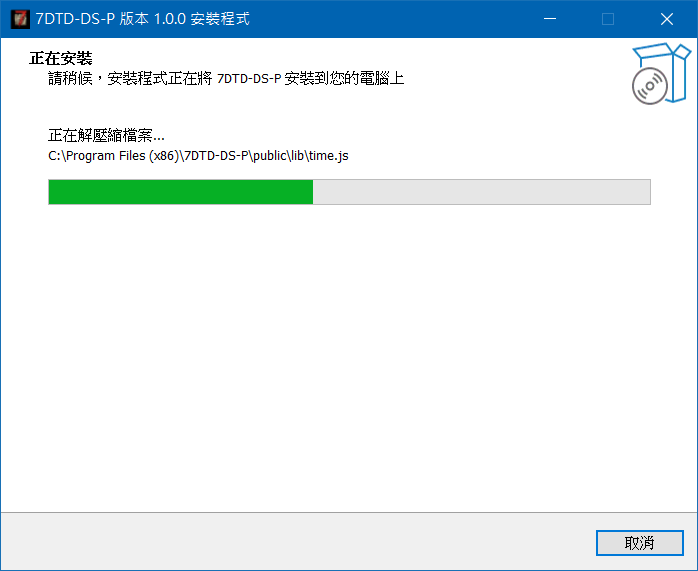

- During installation, the following will be set up:
  - Web Management panel
  - Microsoft Visual C++ Redistributable
  - Amazon Root CA 1.crt root certificate (Epic Online Services)

9. Finish installation  
    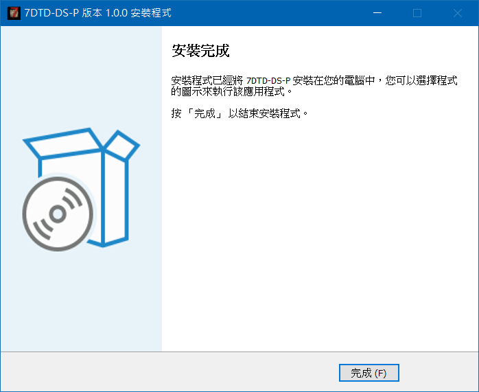  
    Clicking Finish will automatically open the management panel in your browser.
   If nothing happens, manually open your browser and go to `http://localhost:26901`。

10. If the site doesn’t open, check whether the Windows service has been correctly registered and started.  
    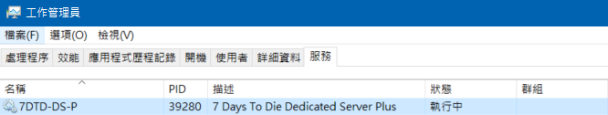

---

## 3. File Structure (What You Should See After Installation)

7DTD-DS-P  
├─ dependencies # Third-party dependencies  
├─ logs # Log files  
├─ nssm # i forgot to delete it lol  
├─ public # Web Management panel and save backup directory  
├─ scripts # Installation scripts  
├─ steamcmd # Requires steamcmd.exe  
└─ (Other files)  
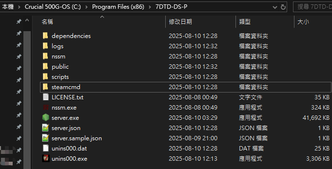

> When installing/updating the game server, files will be placed in `./7DaysToDieServer/`.

---

## 4. First Launch

1. **Open the Management Panel**

   

2. **Download or Update the Game Server (Required)**

   **SteamCMD**

   - In the **SteamCMD** section on the page, select the version and click "Install / Update".  
     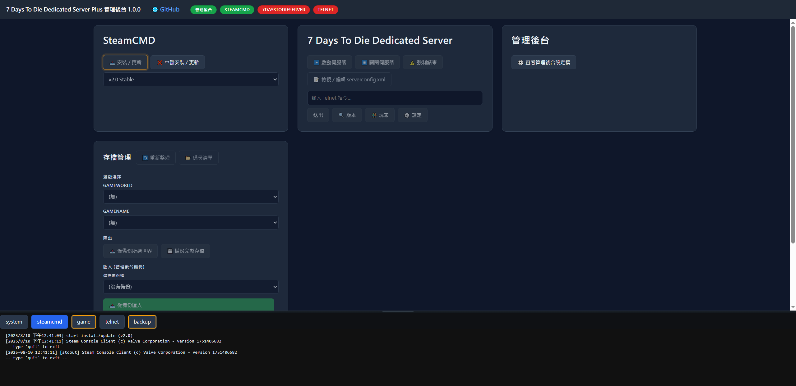
   - When you see "✅ Install / Update complete, Exit Code: 0", it means the process is finished.  
     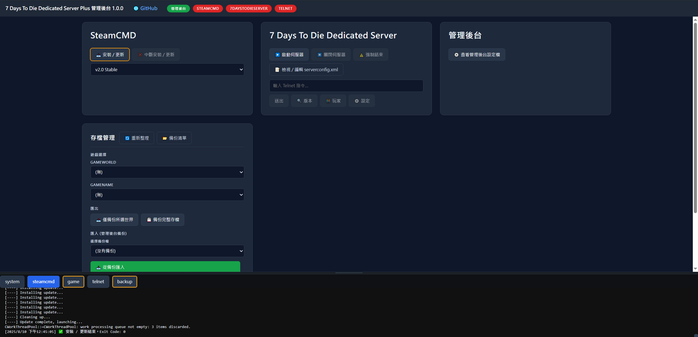

3. **Check and Configure serverconfig.xml**

   - Click "📝 View / Edit serverconfig.xml" on the page.  
     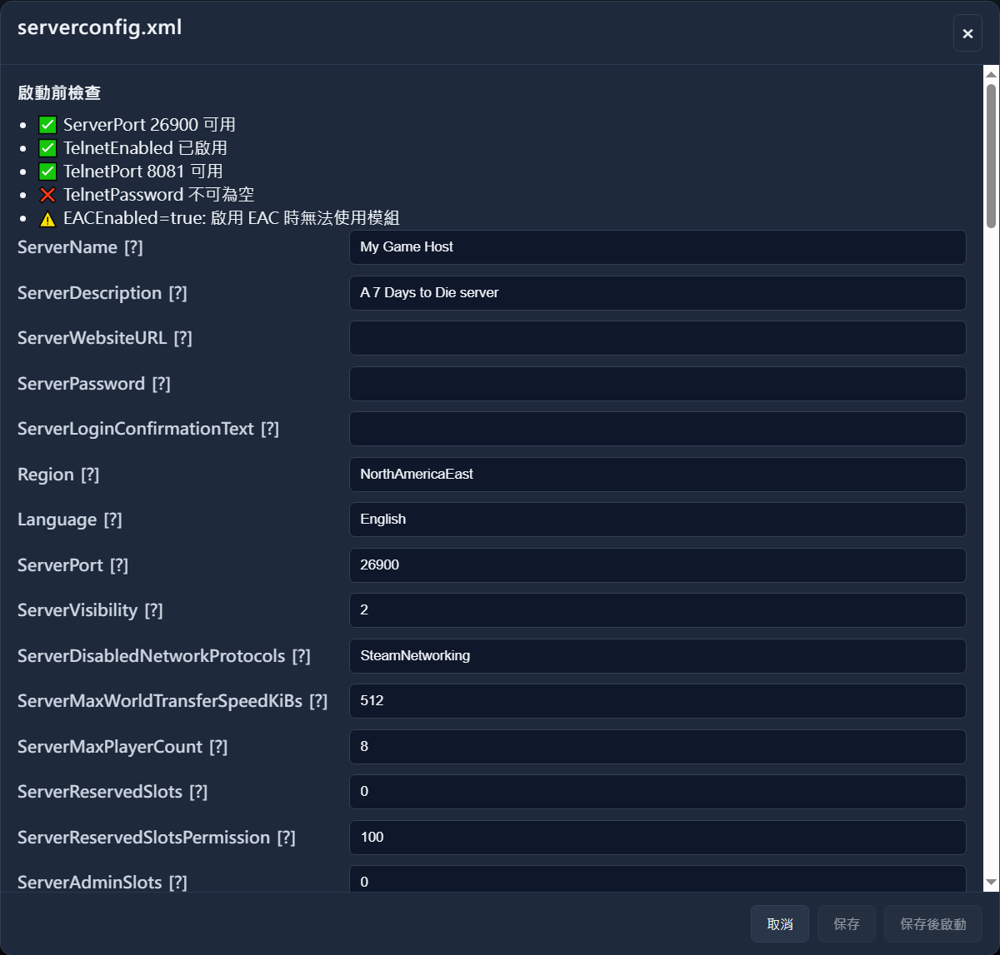
   - Required values
     - `ServerPort`: Default 26900 (7 Days to Die server player connection port)
     - `TelnetEnabled`: True (Enable Telnet for management panel access)
     - `TelnetPort`: Default 8081 (Telnet remote management port)
     - `TelnetPassword`: Set a non-empty password (Telnet remote management password)
   - Suggested values:
     - `EACEnabled`: False (Mods cannot be used when EAC is enabled)
   - After completing the configuration, click "Save and Start".  
     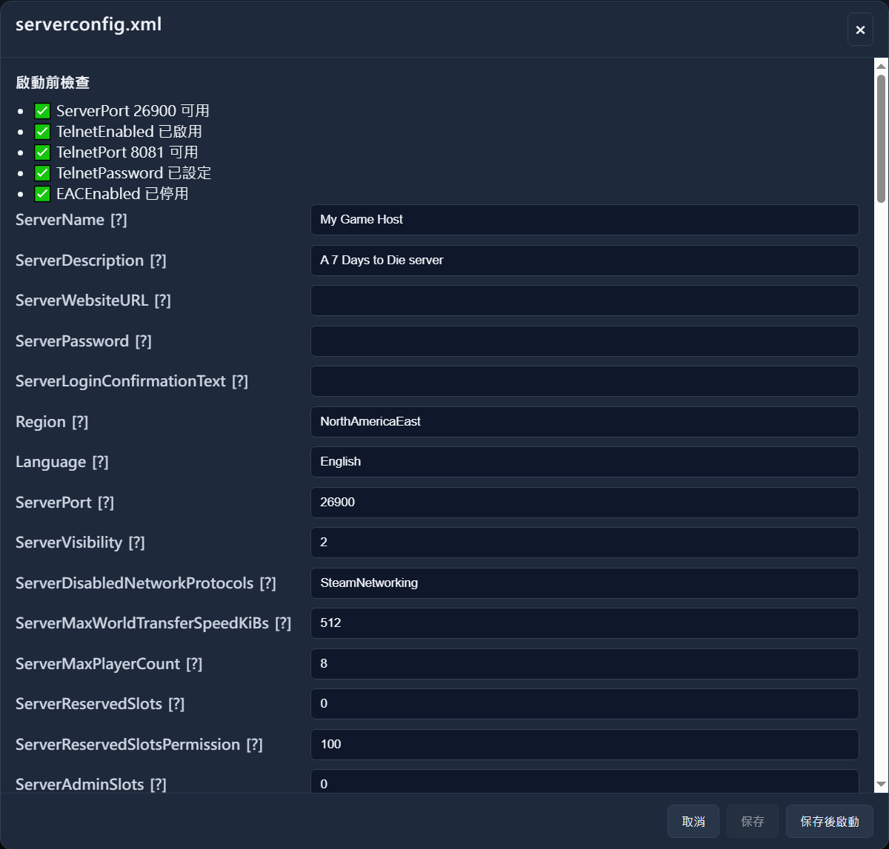

4. **Start the Server**
   - The Console below will display logs in real-time; wait until the game server has fully started before using it.  
     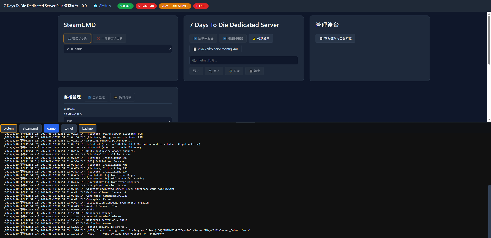

---

## 5. Firewall and Connection

- To allow external players to join your server, please open the following in Windows Firewall/router:
  - `ServerPort` (Game connection)
- The specific port values should be based on your `serverconfig.xml`.

---

## 6. Frequently Asked Questions

- **Management panel is masked, buttons are unresponsive?**  
  When first opened or if the backend is not connected, the page will be **locked** to prevent accidental operations; it will unlock once the status in the management panel turns green.
- **Installation/Update seems slow?**  
  SteamCMD itself may output logs slowly; if the SteamCMD status in the management panel is green, it means it is still running, please be patient and wait for the completion message.
