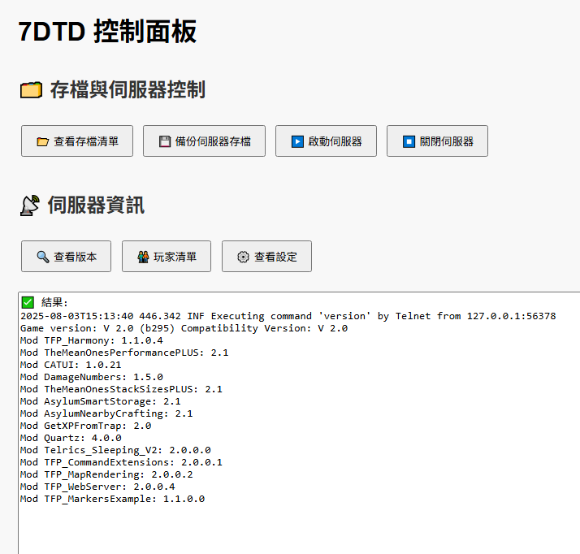

# 7 Days to Die Dedicated Server Plus

🌐 [繁體中文](readme.md) | [English](readme.en.md)

An integrated **Web Control Panel** + **API** management tool for the 7 Days to Die dedicated server.  
Supports installing/updating the Dedicated Server, starting, stopping, backing up save files, Telnet operations, and retrieving server information.  
Ideal as an "all-in-one server starter pack" or for local/LAN server management solutions.



---

## Features

- ✅ **Operate the server via Web**: Start/Stop the Dedicated Server (supports GUI / No GUI modes)
- 📥 **One-click Install/Update**: Integrated `steamcmd` for automatic installation/updates of the game server
- 💾 **Game save file management**
- 📜 **Run as a Windows Service** (supports service installation)
- 🔌 **Mod management** (planned)

---

## Project Structure

7-days-to-die-dedicated-server-plus/
├─ public/ # Frontend Web interface
│ ├─ saves/ # Save file backup directory
│ └─ index.html
├─ server.js # Main API entry point (can be packaged as server.exe)
├─ server.sample.json # Config template (installer will auto-generate server.json)
├─ scripts/ # Utility scripts
├─ tools/
│ ├─ steamcmd
│ ├─ 7-Zip
│ └─ nssm
├─ Amazon Root CA 1.crt # Certificate for resolving EOS connection issues
├─ LICENSE
└─ README.md

---

## Installation & Usage

### 🖥️ For End Users

#### 1. Download and run the installer

The installer will:

- Install required tools (7-Zip / steamcmd / nssm)
- Automatically create `server.json` (including the save path for your user account)
- Register and install as a Windows service (Name: `7DTD-DS-P`)

#### 2. Open the Web Control Panel

After installation, your browser will automatically open:

```
http://localhost:26902/
```

#### 3. Web Interface Features

- Install/Update Dedicated Server (selectable version branches)
- View admin settings (reads `server.json`)
- View server save file list
- Backup saves to ZIP
- Start/Stop the server
- Real-time Telnet commands (version, player list, config query)

---

### 🛠️ For Developers

#### 1. Install Node.js (recommended v22+)

- [https://nodejs.org/](https://nodejs.org/)

#### 2. Install dependencies

```bat
cd src\web
npm install
```

#### 3. Create the config file

```bat
cd src\web
copy server.sample.json server.json
```

Edit the file according to your environment paths and ports.

#### 4. Start the service

```bat
npm start
```

5. Access the admin panel

```bat
http://localhost:26903/
```

## Common API Endpoints

| Path               | Method | Description                                         |
| ------------------ | ------ | --------------------------------------------------- |
| `/api/install`     | POST   | Install/Update Dedicated Server                     |
| `/api/start`       | POST   | Start the server (supports `{ nographics: true }`)  |
| `/api/stop`        | POST   | Stop the server                                     |
| `/api/backup`      | POST   | Backup game saves                                   |
| `/api/view-saves`  | POST   | View all backups                                    |
| `/api/telnet`      | POST   | Send Telnet command (requires `{ command: "xxx" }`) |
| `/api/view-config` | POST   | View admin settings                                 |

---

## Config File Reference (server.json)

| Field                        | Description                     |
| ---------------------------- | ------------------------------- |
| `web.port`                   | Port for the Web API            |
| `game_server.ip`             | Server IP (usually `127.0.0.1`) |
| `game_server.port`           | Game connection port            |
| `game_server.telnetPort`     | Telnet admin port               |
| `game_server.telnetPassword` | Telnet password                 |
| `game_server.serverConfig`   | Path to `serverconfig.xml`      |

# License

This project is licensed under **GPLv3**.  
You are free to modify and redistribute it, but you must keep it open source and under the same GPL terms.
