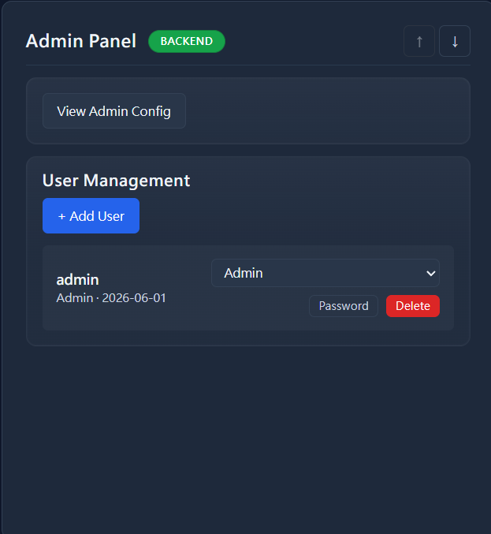
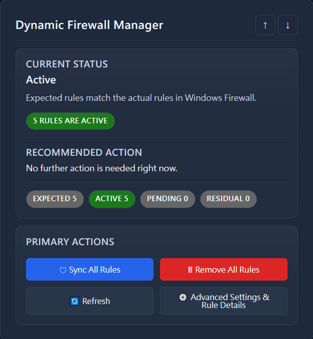
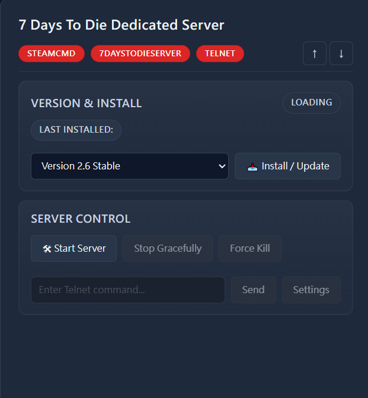
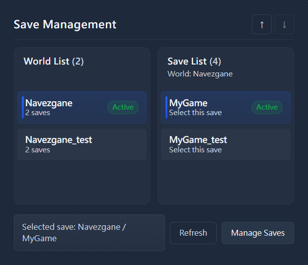

# 7 Days to Die Dedicated Server Plus

### 📦 [Open Source Repository](https://github.com/waynechen251/7-days-to-die-dedicated-server-plus.git) ｜ [GitHub Release](https://github.com/waynechen251/7-days-to-die-dedicated-server-plus/releases) ｜ [Bahamut Forum](https://forum.gamer.com.tw/Co.php?bsn=24608&sn=6631)

### 🌐 Documentation: [繁體中文](https://github.com/waynechen251/7-days-to-die-dedicated-server-plus/blob/main/readme.md) ｜ [English](https://github.com/waynechen251/7-days-to-die-dedicated-server-plus/blob/main/readme.en.md)

### 🌐 Installation Guide: [繁體中文](https://github.com/waynechen251/7-days-to-die-dedicated-server-plus/blob/main/docs/install.md) ｜ [English](https://github.com/waynechen251/7-days-to-die-dedicated-server-plus/blob/main/docs/install.en.md)

---

## About

7 Days to Die Dedicated Server Plus is a server management tool designed specifically for Windows. With an intuitive web interface, you can easily install, update, configure, and manage your game server without complex command-line operations.

### Key Features

- **One-Click Install/Update** - Quickly deploy game servers via SteamCMD
- **Web Interface Management** - Intuitive web interface for editing serverconfig.xml
- **Real-Time Console Monitoring** - View server logs and status in real-time
- **Save Backup & Restore** - Easily import and export server saves
- **Windows Service** - Install as a system service for automatic startup

---

## Quick Start

### Download

Go to [GitHub Releases](https://github.com/waynechen251/7-days-to-die-dedicated-server-plus/releases) to download the latest installer.

### Three Steps to Get Started

1. **Run the Installer** - Follow the wizard to complete installation
2. **Install the Game Server** - Click "Install / Update" in the management panel
3. **Configure and Launch** - Set up serverconfig.xml and click "Save and Start"

For detailed instructions, see the [Installation Guide](docs/install.en.md).

---

## Feature List

The sections below follow the main dashboard cards and their related modal windows, so readers can understand each area more easily when paired with card screenshots and modal screenshots.

### Admin Panel Card

- This card is used to manage the admin panel itself, including core settings and account permissions.
- You can check the admin panel status here and open the server.json viewer.
- Administrators can add, edit, and delete users directly from this card, and assign Admin, Operator, or Viewer roles.
- On first launch, the setup flow creates the first administrator account before the normal sign-in flow is used.
- The modal lets you reload or copy server.json, which is useful for verifying deployment settings, connection details, and save-path related configuration.

### Dynamic Firewall Management Card

- This card focuses on Windows Firewall management, with the main card showing the current status and suggested actions first.
- You can quickly review the firewall summary, recommended action, rule differences, and permission warnings.
- Main actions include syncing all rules, removing all rules, refreshing the current status, and opening advanced settings with rule details.
- In the modal, you can adjust automation policies such as applying rules when the game server starts and removing game rules when the server stops.
- The modal also shows managed game ports, management ports, raw rule names, and the full candidate rule list for troubleshooting connectivity issues.

### 7 Days To Die Dedicated Server Card

- This is the main day-to-day operations card for version selection, installation, live status, and Telnet control.
- You can choose a server version, install or update the server, and review the version source plus the last installed version.
- Once the server is running, the card shows live status such as players, FPS, zombies, Heap, Max, RSS, and the game version.
- The control area can start the server, stop it gracefully, or force-kill it when needed.
- The built-in Telnet input lets you send commands directly or quickly inspect server settings.
- The modal opens the serverconfig.xml editor, where you can review fields, load the last saved settings, save changes, or save and start immediately. Editing is locked while the server is running.

### Save Management Card

- This card is used to browse available worlds and saves before moving into detailed save operations.
- From the main card, you can quickly review the world list, the save list, and the current selection.
- The main card also provides refresh and Manage Saves as the entry point for deeper operations.
- The modal is split into Entire Saves and Single Save, so full backup workflows are separated from per-save workflows.
- In the single-save area, you can switch the active world/save, export a selected save, delete a save, and manage single-save backups.
- The modal also supports uploading ZIP files for direct import, whether for the entire Saves directory or for a single save.

### Bottom Console Panel

- The console panel at the bottom works together with the cards above and is useful for showing the actual result of each action.
- It provides five tabs: Admin Panel, SteamCMD, 7DaysToDieServer, Telnet, and Save Management.
- During installation, startup, Telnet operations, backup, or restore, you can track live output and error messages here.
- On startup, the panel also checks for version updates and supports switching between Traditional Chinese, English, and Simplified Chinese.

---

## System Requirements

| Item             | Requirement                                      |
| ---------------- | ------------------------------------------------ |
| Operating System | Windows 10/11 (64-bit), Windows Server 2019/2022 |
| Disk Space       | At least 20 GB (including game server and backups) |
| Memory           | At least 16 GB RAM                               |
| Network          | Stable network connection                        |

---

## License

This project is licensed under [GPL-3.0](LICENSE).

---

## Related Links

- [Installation Guide](docs/install.en.md)
- [Bahamut Forum](https://forum.gamer.com.tw/Co.php?bsn=24608&sn=6631)
- [Report Issues](https://github.com/waynechen251/7-days-to-die-dedicated-server-plus/issues)
