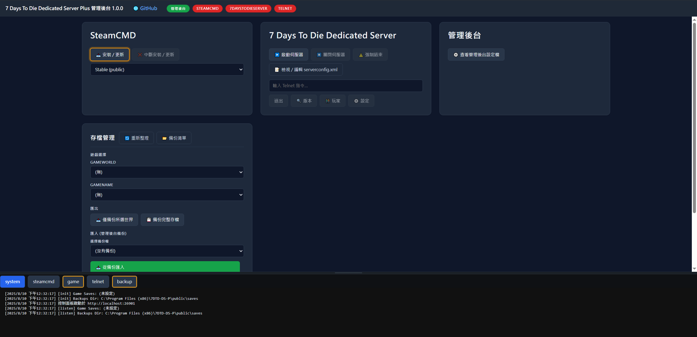

# 7 Days to Die Dedicated Server Plus

### 📦 [開源專案倉庫](https://github.com/waynechen251/7-days-to-die-dedicated-server-plus.git) ｜ [GitHub Release](https://github.com/waynechen251/7-days-to-die-dedicated-server-plus/releases) ｜ [巴哈姆特](https://forum.gamer.com.tw/Co.php?bsn=24608&sn=6631)

### 🌐 說明文件： [繁體中文](https://github.com/waynechen251/7-days-to-die-dedicated-server-plus/blob/main/readme.md) ｜ [English](https://github.com/waynechen251/7-days-to-die-dedicated-server-plus/blob/main/readme.en.md)

### 🌐 安裝指南： [繁體中文](https://github.com/waynechen251/7-days-to-die-dedicated-server-plus/blob/main/docs/install.md) ｜ [English](https://github.com/waynechen251/7-days-to-die-dedicated-server-plus/blob/main/docs/install.en.md)

---

## 專案簡介

7 Days to Die Dedicated Server Plus 是一款專為 Windows 設計的七日殺伺服器管理工具。透過直覺的 Web 介面，讓你輕鬆安裝、更新、設定與管理遊戲伺服器，無需複雜的命令列操作。

### 主要特色

- **一鍵安裝/更新** - 透過 SteamCMD 快速部署遊戲伺服器
- **Web 介面管理** - 直覺的網頁介面編輯 serverconfig.xml
- **即時 Console 監控** - 即時查看伺服器日誌與狀態
- **存檔備份與還原** - 輕鬆匯入匯出伺服器存檔
- **Windows 服務** - 安裝為系統服務，開機自動啟動

### 截圖展示

---

## 快速開始

### 下載

前往 [GitHub Releases](https://github.com/waynechen251/7-days-to-die-dedicated-server-plus/releases) 下載最新版本的安裝檔。

### 三步驟快速啟動

1. **執行安裝程式** - 依照引導完成安裝
2. **安裝遊戲伺服器** - 在管理後台點擊「安裝 / 更新」
3. **設定並啟動** - 設定 serverconfig.xml 後點擊「保存後啟動」

詳細說明請參閱 [安裝指南](docs/install.md)。

---

## 功能清單

### 後台管理

| 功能                  | 描述               |
| --------------------- | ------------------ |
| serverconfig.xml 管理 | 提供網頁代管、編輯 |
| Logs 整合             | 簡化排查難度       |

### 7 Days to Die Dedicated Server & SteamCMD 整合管理

| 功能                      | 描述                     |
| ------------------------- | ------------------------ |
| 伺服器版本選單            | 簡單切換伺服器版本       |
| 一鍵安裝/更新             | 快速部署伺服器           |
| 啟動/關閉伺服器           | 支援正常/強制關閉        |
| 網頁編輯 serverconfig.xml | 並針對 UI 優化           |
| 自訂存檔路徑              | 支援 UserDataFolder 參數 |
| 查看伺服器狀態            | 玩家列表、設定檢視       |
| 存檔清單                  | 快速檢視                 |

### 存檔管理

| 功能         | 描述                 |
| ------------ | -------------------- |
| 匯入所有存檔 | 將備份壓入為現有存檔 |
| 匯入指定存檔 | 指定單一存檔匯入     |
| 匯出所有存檔 | 批次匯出             |
| 匯出指定存檔 | 單一匯出             |
| 刪除所有存檔 | 清空存檔             |
| 刪除指定存檔 | 單一刪除             |

---

## 系統需求

| 項目       | 需求                                          |
| ---------- | --------------------------------------------- |
| 作業系統   | Windows 10/11 (64-bit), Windows Server 2019/2022 |
| 磁碟空間   | 至少 20 GB (含遊戲伺服器與備份)               |
| 記憶體     | 至少 16 GB RAM                                |
| 網路       | 穩定的網路連線                                |

---

## 已發布版本

| 版本號 | 下載地址                                                                                                                                                                  | MD5                              | 發布時間   |
| ------ | ------------------------------------------------------------------------------------------------------------------------------------------------------------------------- | -------------------------------- | ---------- |
| 1.0.5  | [MediaFire](https://www.mediafire.com/file/oyltf6szv2glbtv/7DTD-DS-P-Setup(1.0.5).zip/file) | 6EEE7DE87318F471795C653AE64B56DE | 2026-02-03 |
| 1.0.4  | [MediaFire](https://www.mediafire.com/file/q6rtmhe3zpzall3/7DTD-DS-P-Setup(1.0.4).zip/file) | E543775B54B8DCDBC3486831B3546C0A | 2026-01-28 |
| 1.0.3  | [MediaFire](https://www.mediafire.com/file/0mv8wqm0fsixnem/7DTD-DS-P-Setup(1.0.3).zip/file) | B4C4FBF2FCA9B5751B433E077AADAC2C | 2025-08-24 |
| 1.0.2  | [MediaFire](https://www.mediafire.com/file/o8wu6zpppxpcfu9/7DTD-DS-P-Setup(1.0.2).zip/file) | F6203D69C4CB8F9ED2A461C4D9DE9E5A | 2025-08-17 |
| 1.0.1  | [MediaFire](https://www.mediafire.com/file/8x04vqj5bee99pf/7DTD-DS-P-Setup(1.0.1).zip/file) | 88C5D42677B44C31B0C86E8BD3EF7B3F | 2025-08-12 |
| 1.0.0  | [MediaFire](https://www.mediafire.com/file/7ndv20j4jmpug9w/7DTD-DS-P-Setup(1.0.0).zip/file) | A637F79C1AE04B58B3AD8C9E7F065F2F | 2025-08-10 |

---

## 開發路線圖

### 後台管理

| 功能                  | 狀態     | 描述               |
| --------------------- | -------- | ------------------ |
| serverconfig 編輯介面 | 規劃中   | 再度優化           |
| 遠端管理權限控管      | 規劃中   | 提升安全性         |
| 多語系 i18n           | 規劃中   | 支援英文與更多語言 |
| 後台版本檢查          | 規劃中   | 線上檢測更新       |
| 手機相容性            | 規劃中   | 提升手機版體驗     |

### 存檔管理

| 功能               | 狀態   | 描述             |
| ------------------ | ------ | ---------------- |
| Saves 存檔下載     | 規劃中 | 提供直接下載     |
| GameWorld 存檔下載 | 規劃中 | 支援完整存檔下載 |

### 模組管理

| 功能         | 狀態   | 描述             |
| ------------ | ------ | ---------------- |
| 匯入所有模組 | 規劃中 | 一次匯入所有模組 |
| 匯入指定模組 | 規劃中 | 單一模組匯入     |
| 匯出所有模組 | 規劃中 | 批次匯出         |
| 匯出指定模組 | 規劃中 | 單一模組匯出     |
| 單模組下載   | 規劃中 | 單一模組下載     |
| 全模組下載   | 規劃中 | 批次下載所有模組 |
| 刪除指定模組 | 規劃中 | 移除指定模組     |
| 刪除全模組   | 規劃中 | 清空模組         |
| 刪除模組備份 | 規劃中 | 支援指定刪除備份 |

> ※ 客戶端與伺服器模組需一致

### 語系翻譯

| 功能     | 狀態   | 描述                 |
| -------- | ------ | -------------------- |
| tchinese | 規劃中 | 挖太多坑了，有空再說 |

---

## 授權協議

本專案採用 [GPL-3.0](LICENSE) 授權。

---

## 相關連結

- [安裝指南](docs/install.md)
- [巴哈姆特討論串](https://forum.gamer.com.tw/Co.php?bsn=24608&sn=6631)
- [回報問題](https://github.com/waynechen251/7-days-to-die-dedicated-server-plus/issues)
