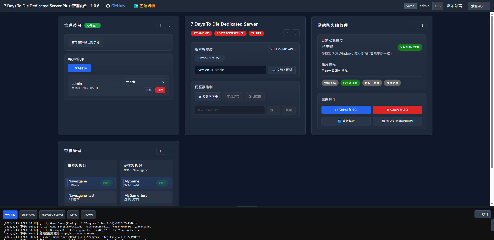
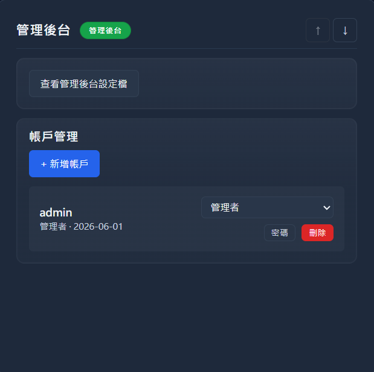
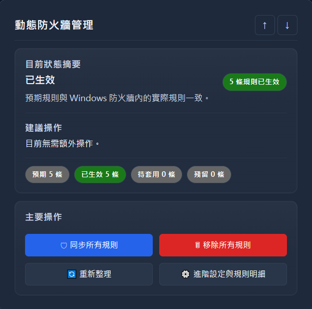
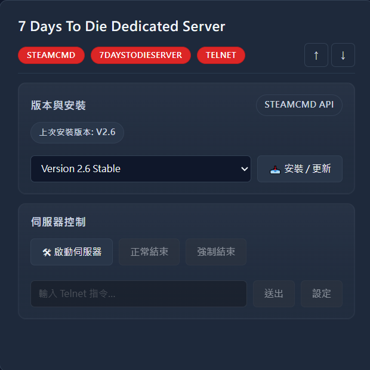
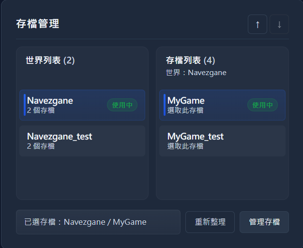
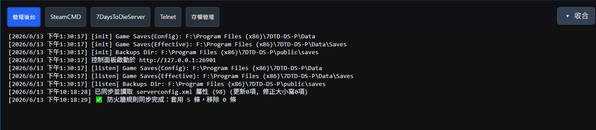

# 7 Days to Die Dedicated Server Plus

### 📦 [開源專案倉庫](https://github.com/waynechen251/7-days-to-die-dedicated-server-plus.git) ｜ [GitHub Release](https://github.com/waynechen251/7-days-to-die-dedicated-server-plus/releases) ｜ [巴哈姆特](https://forum.gamer.com.tw/Co.php?bsn=24608&sn=6631)

### 🌐 說明文件： [繁體中文](https://github.com/waynechen251/7-days-to-die-dedicated-server-plus/blob/main/readme.md) ｜ [English](https://github.com/waynechen251/7-days-to-die-dedicated-server-plus/blob/main/readme.en.md)

### 🌐 安裝指南： [繁體中文](https://github.com/waynechen251/7-days-to-die-dedicated-server-plus/blob/main/docs/install.md) ｜ [English](https://github.com/waynechen251/7-days-to-die-dedicated-server-plus/blob/main/docs/install.en.md)

---

## 專案簡介

7 Days to Die Dedicated Server Plus 是一款專為 Windows 設計的七日殺伺服器管理工具。透過直覺的 Web 介面，讓你輕鬆安裝、更新、設定與管理遊戲伺服器，無需複雜的命令列操作。

### 主要特色

- **一鍵安裝/更新** - 透過 SteamCMD 快速部署遊戲伺服器
- **Web 介面管理** - 直覺的網頁介面編輯 serverconfig.xml
- **即時 Console 監控** - 即時查看伺服器日誌與狀態
- **存檔備份與還原** - 輕鬆匯入匯出伺服器存檔
- **Windows 服務** - 安裝為系統服務，開機自動啟動

---

## 快速開始

### 下載

前往 [GitHub Releases](https://github.com/waynechen251/7-days-to-die-dedicated-server-plus/releases) 下載最新版本的安裝檔。

### 三步驟快速啟動

1. **執行安裝程式** - 依照引導完成安裝
2. **安裝遊戲伺服器** - 在管理後台點擊「安裝 / 更新」
3. **設定並啟動** - 設定 serverconfig.xml 後點擊「保存後啟動」

詳細說明請參閱 [安裝指南](docs/install.md)。

---

## 功能清單

以下依照主畫面的卡片與對應開窗整理，方便搭配卡片截圖與開窗截圖一起看懂每一塊在做什麼。

### 管理後台卡片

- 卡片上可以查看管理後台狀態，並開啟 server.json 檢視視窗。
- 管理者可以在卡片內直接管理帳戶，新增、編輯、刪除使用者，並分配管理者、操作員、觀察者角色。
- 首次啟用時會先建立第一個管理者帳戶，之後再進入正常登入流程。
- 開窗後可以重新讀取或複製 server.json 內容，方便核對目前部署設定、連線資訊與存檔路徑配置。

### 動態防火牆管理卡片

- 卡片上可以快速看到規則摘要、建議操作、目前差異與權限提醒。
- 主操作包含同步所有規則、移除所有規則、重新整理，以及開啟進階設定與規則明細。
- 開窗後可以調整自動化策略，例如啟動伺服器時自動套用規則、停止時自動移除規則。
- 開窗後也能檢視目前納入管理的遊戲埠、管理埠、原始規則名稱與完整候選規則，方便排查連線問題。

### 7 Days To Die Dedicated Server 卡片

- 卡片上可以選擇伺服器版本，執行安裝 / 更新，並看到版本來源與上次安裝版本。
- 伺服器啟動後，卡片會顯示即時狀態，例如玩家數、FPS、殭屍數、Heap、Max、RSS 與遊戲版本。
- 控制區可直接啟動伺服器、正常結束，或在異常時強制結束進程。
- 卡片內建 Telnet 輸入區，可直接送出指令，也可快速查詢設定。
- 開窗後會進入 serverconfig.xml 編輯器，可檢查欄位、載入上次保存設定、保存變更，或保存後直接啟動伺服器；伺服器運行中則會鎖定編輯。

### 存檔管理卡片

- 卡片上可以先從世界列表與存檔列表快速瀏覽目前資料，並確認目前選取目標。
- 主卡片提供重新整理與「管理存檔」入口，方便先選擇再操作。
- 開窗後分成「整個 Saves」與「單一存檔」兩區，前者適合做整包備份、整包匯入與完整備份清單管理。
- 單一存檔區可切換使用中的 world / save、匯出指定存檔、刪除存檔，並管理單一存檔備份。
- 開窗內也支援上傳 ZIP 後直接匯入，無論是整個 Saves 或單一存檔都有對應流程。

### 下方 Console 區

- 提供管理後台、SteamCMD、7DaysToDieServer、Telnet、存檔管理五個分頁。
- 進行安裝、啟動、Telnet、備份或還原時，可以直接在這裡追蹤即時輸出與錯誤訊息。
- 啟動後也會檢查版本更新，並支援切換繁體中文、English、簡體中文介面。

---

## 系統需求

| 項目       | 需求                                          |
| ---------- | --------------------------------------------- |
| 作業系統   | Windows 10/11 (64-bit), Windows Server 2019/2022 |
| 磁碟空間   | 至少 20 GB (含遊戲伺服器與備份)               |
| 記憶體     | 至少 16 GB RAM                                |
| 網路       | 穩定的網路連線                                |

---

## 授權協議

本專案採用 [GPL-3.0](LICENSE) 授權。

---

## 相關連結

- [安裝指南](docs/install.md)
- [巴哈姆特討論串](https://forum.gamer.com.tw/Co.php?bsn=24608&sn=6631)
- [回報問題](https://github.com/waynechen251/7-days-to-die-dedicated-server-plus/issues)
